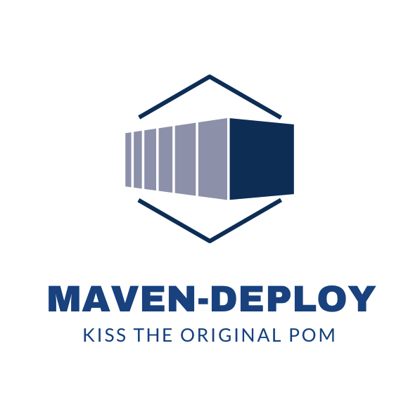

# deployment-maven-plugin

[![License][License-Image]][License-Url]
[![Build][Build-Status-Image]][Build-Status-Url] 
[![Coverage][Coverage-image]][Coverage-Url] 
[![Maintainable][Maintainable-image]][Maintainable-Url] 
[![Gitter][Gitter-image]][Gitter-Url] 

### Description
This is an example/alternative to [maven-oss-parent](https://github.com/YunaBraska/maven-oss-parent) to separate the deployment from build process and keep original the pom.xml small.
Auto handles surfire and failsafe, auto semantic version increase by branch pattern  


### plugin
````xml
<plugin>
    <groupId>berlin.yuna</groupId>
    <artifactId>deployment-maven-plugin</artifactId>
    <version>0.0.1</version>
</plugin>
````

### How to call
````bash
mvn deployment:run -Dargs="--JAVA_DOC=true --SOURCE --UPDATE=true"
#Will create java doc, java sources, and updates dependencies
````

### SEMANTIC_FORMAT
* Syntax \[1.2.3\]
````"<separator>::<major>::<minor>::<patch>"````
* Example \[1-2.3.4-5\]
````"[.-]::release::feature::bugfix\|hotfix::custom_1.*[0-9]::custom_2.*[A-Z]"````

### Versioning
| Parameter           | Type    | Default |  Description                                                               |
|:--------------------|:--------|:--------|:---------------------------------------------------------------------------|
| PROJECT_VERSION     | String  | ''      | Sets project version in pom                                                |
| SEMANTIC_FORMAT     | String  | ''      | Updates semantic version from regex pattern (overwrites PROJECT_VERSION)   |
| REMOVE_SNAPSHOT     | Boolean | false   | Removes snapshot from version                                              |
| TAG                 | Boolean | false   | Tags the project (by PROJECT_VERSION) if not already exists                |
| TAG_BREAK           | Boolean | false   | Tags the project (by PROJECT_VERSION) and fails if already exists          |
| UPDATE              | Boolean | false   | Updates parent, properties, dependencies                                   |
### Building
| Parameter           | Type    | Default |  Description                                                               |
|:--------------------|:--------|:--------|:---------------------------------------------------------------------------|
| CLEAN               | Boolean | false   | cleans target and resolves dependencies                                    |
| CLEAN_CACHE         | Boolean | false   | Purges local maven repository cache                                        |
| JAVA_DOC            | Boolean | true    | Creates java doc (javadoc.jar) if its not a pom artifact                   |
| SOURCE              | Boolean | true    | Creates java sources (sources.jar) if its not a pom artifact               |
| PROFILES            | Boolean | true    | Uses all available profiles                                                |
| GPG_PASS            | String  | ''      | Signs artifacts (.asc) with GPG 2.1                                        |
| GPG_PASS_ALT        | String  | ''      | Signs artifacts (.asc) with GPG 1                                          |
### Deployment
| Parameter           | Type    | Default |  Description                                                               |
|:--------------------|:--------|:--------|:---------------------------------------------------------------------------|
| DEPLOY_ID           | String  | ''      | (Nexus) Deploys artifacts (id = Settings.xml)                              |
| RELEASE             | Boolean | false   | (Nexus) Releases the deployment                                            |
### Misc
| Parameter           | Type    | Default |  Description                                                               |
|:--------------------|:--------|:--------|:---------------------------------------------------------------------------|
| REPORT              | Boolean | false   | Generates report about version updates                                     |
| OPTIONS             | String  | ''      | Adds additional maven options                                              |
| ENCODING            | String  | ''      | Sets compiler encoding                                                     |
| SKIP_TEST           | Boolean | true    | skips all tests                                                            |
| JAVA_VERSION        | String  | ''      | Sets compiler java version                                                 |

### Requirements
* \[JAVA\] for maven 
* \[MAVEN\] to run maven commands
* \[GIT\] for tagging

### Technical links
* [maven-javadoc-plugin](https://maven.apache.org/plugins/maven-javadoc-plugin/)
* [maven-source-plugin](https://maven.apache.org/plugins/maven-source-plugin/)
* [maven-surefire-plugin](http://maven.apache.org/surefire/maven-surefire-plugin/test-mojo.html)
* [versions-maven-plugin](https://www.mojohaus.org/versions-maven-plugin/set-mojo.html)
* [maven-gpg-plugin](http://maven.apache.org/plugins/maven-gpg-plugin/usage.html)
* [upload-an-artifact-into-Nexus](https://support.sonatype.com/hc/en-us/articles/213465818-How-can-I-programmatically-upload-an-artifact-into-Nexus-2-)

### TODO
* [ ] option/param git commit changes (git stash; mvnCommand; git commit; git stash pop) (default "\[SEMANTEC|CI\] version update")
* [ ] option/param UPDATE_MINOR UPDATE MAJOR
* [ ] not tag when last commit was tag commit
* [ ] external settings "--settings "
* [ ] release process
* [ ] set always autoReleaseAfterClose=false and add "mvn nexus-staging:release" to release process
* [ ] release needs a new version to be set manually
* [ ] set scm url if not exists or changed
* [ ] reset readme urls, description and title
* [ ] Deploy dynamic to nexus
* [ ] Deploy dynamic to artifactory
* [ ] try to use https://github.com/TimMoore/mojo-executor

* [ ] find out how to use GPG 2.1 on command line with original apache maven-gpg-plugin
* [ ] org.sonatype.plugins
* [ ] own or buy logo https://www.designevo.com/apps/logo/?name=blue-hexagon-and-3d-container



[License-Url]: https://www.apache.org/licenses/LICENSE-2.0
[License-Image]: https://img.shields.io/badge/License-Apache2-blue.svg
[github-release]: https://github.com/YunaBraska/maven-deployment
[Build-Status-Url]: https://travis-ci.org/YunaBraska/maven-deployment
[Build-Status-Image]: https://travis-ci.org/YunaBraska/maven-deployment.svg?branch=master
[Coverage-Url]: https://codecov.io/gh/YunaBraska/maven-deployment?branch=master
[Coverage-image]: https://codecov.io/gh/YunaBraska/maven-deployment/branch/master/graphs/badge.svg
[Version-url]: https://github.com/YunaBraska/maven-deployment
[Version-image]: https://badge.fury.io/gh/YunaBraska%2Fmaven-deployment.svg
[Central-url]: https://search.maven.org/#search%7Cga%7C1%7Ca%3A%22maven-deployment%22
[Central-image]: https://maven-badges.herokuapp.com/maven-central/berlin.yuna/maven-deployment/badge.svg
[Maintainable-Url]: https://codeclimate.com/github/YunaBraska/maven-deployment
[Maintainable-image]: https://codeclimate.com/github/YunaBraska/maven-deployment.svg
[Gitter-Url]: https://gitter.im/nats-streaming-server-embedded/Lobby
[Gitter-image]: https://img.shields.io/badge/gitter-join%20chat%20%E2%86%92-brightgreen.svg
[Javadoc-url]: http://javadoc.io/doc/berlin.yuna/maven-deployment
[Javadoc-image]: http://javadoc.io/badge/berlin.yuna/maven-deployment.svg